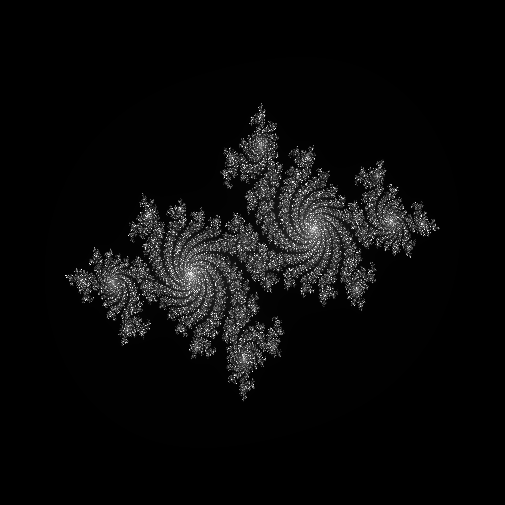

# Julia Set Fractal
This project generates a Julia Set fractal using the Julia programming language, and saves it as a PNG image. You can explore different fractal shapes and levels of detail by modifying key parameters, such as image size, iteration depth, and the complex constant.

## Requirements
* Julia programming language (https://julialang.org/downloads/)
* `Images.jl` package

## Setup
To install the needed package, open the Julia REPL and run:  
```
using Pkg
Pkg.add("Images")
```

## Execution
Run the script using:
```
julia julia.jl
```

## Customisation
The following parameters can be edited to alter the fractal's appearance:
```
width, height, max_iterations = 2000, 2000, 1000 # Edit parameters
c = -0.7 + 0.27015im #  Edit complex constant
```
* __Resolution__: Increase `width` and `height` for a higher-resolution image.
* __Iterations__: A higher `max_iterations` value will increase detail, but result in longer rendering times. 
* __Complex Constant__: Altering `c` will result in unique fractal structures. E.g. try `0.355 + 0.355im` or `-0.8 + 0.156im`.

## Preview:

